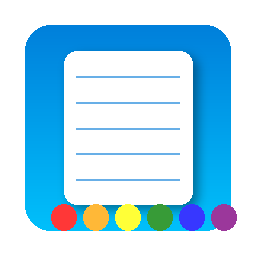

# 📝 C0lorNote

A modern note-taking application built with PyQt6, featuring rich text editing, code editing with syntax highlighting, and three beautiful themes. This completely redesigned version provides a sleek, responsive interface inspired by popular note apps like Notion, Google Keep, and Apple Notes.



## ✨ Features

C0lorNote has been completely rebuilt with PyQt6 to provide a modern, feature-rich experience:

- 🎨 **Three Beautiful Themes**: Choose between Matrix (hacker-style), Dreamcore (surreal pastels), or Minimalist (soft yellow)
- 📝 **Rich Text Editing**: Format text with bold, italic, underline, and custom colors
- 💻 **Code Editor**: Dedicated code environment with Python syntax highlighting
- 🏃 **Run Code**: Execute Python code snippets directly with F5 key
- 🔍 **Fast Search**: Instantly find notes as you type in the search bar
- 🏷️ **Organization**: Categorize and tag notes for easy filtering
- 🔄 **Smart Views**: Quickly access all notes, recent notes, or code snippets
- 📤 **Export Options**: Save notes as HTML, Python code, or plain text files
- 💾 **Auto-saving**: Notes are automatically saved as you work
- 👤 **Branded UI**: Includes subtle @marbleceo branding in the status bar.

## 🎭 Themes

### 🖥️ Matrix Theme
A hacker-inspired theme with bright green text on black backgrounds. Perfect for coding sessions and creating a cyberpunk atmosphere while taking notes.

### 🌈 Dreamcore Theme
A surreal theme with deep purples and vibrant pinks that creates a creative, dreamy environment for your notes. Ideal for brainstorming and artistic projects.

### 🌞 Minimalist Theme
A clean, distraction-free theme with soft yellow accents on a light background. Great for everyday note-taking and focused writing.

## 📸 Screenshots

*Note: The following are descriptions of the application's appearance with each theme. Replace with actual screenshots when available.*

- **Matrix Theme**: Dark black interface with neon green text, code highlighting in bright green and blue tones, creating a terminal-like experience.

- **Dreamcore Theme**: Rich purple background with pink accents, featuring pastel-colored UI elements and a dreamy aesthetic.

- **Minimalist Theme**: Clean white interface with soft yellow accents, minimal UI elements, and plenty of whitespace for distraction-free writing.

## 📋 Requirements

- Python 3.6 or newer
- PyQt6
- Additional dependencies installed via pip

## 🚀 Installation

### Using Virtual Environment (Recommended)

```bash
# Clone the repository (if you haven't already)
git clone https://github.com/yourusername/c0lornote.git
cd c0lornote

# Create a virtual environment
python -m venv venv

# Activate the virtual environment
# On Linux/macOS:
source venv/bin/activate
# On Windows:
# venv\Scripts\activate

# Install PyQt6
pip install PyQt6

# Run the application
python modern_colornote.py
```

### Creating a Desktop Entry (Linux)

To launch C0lorNote like any other desktop application:

```bash
# Create the desktop entry file
cat > ~/.local/share/applications/c0lornote.desktop << EOF
[Desktop Entry]
Name=C0lorNote
Comment=A modern note-taking application
Exec=/path/to/your/venv/bin/python /path/to/your/c0lornote/modern_colornote.py
Icon=/path/to/your/c0lornote/assets/c0lornote.png
Terminal=false
Type=Application
Categories=Utility;TextEditor;
StartupNotify=true
EOF

# Update desktop database
update-desktop-database ~/.local/share/applications
```

## 🖱️ Usage

### Basic Operations

- **Create a Note**: Click the "+ New Note" button in the note list panel
- **Save a Note**: Press Ctrl+S or use File > Save (auto-saving is also enabled)
- **Delete a Note**: Select the note and press Delete or use Edit > Delete Note
- **Export a Note**: Use File > Export Note to save as HTML, Python, or text

### Keyboard Shortcuts

| Shortcut | Action |
|----------|--------|
| Ctrl+N | Create new note |
| Ctrl+S | Save current note |
| Ctrl+E | Export note |
| Delete | Delete selected note |
| F5 | Run code (in code editor) |
| Ctrl+B | Bold text |
| Ctrl+I | Italic text |
| Ctrl+U | Underline text |
| Ctrl+F | Focus search bar |

### Rich Text Editing

1. Select the "Rich Text" tab in the editor
2. Use the formatting toolbar to apply:
   - Bold, italic, or underline formatting
   - Text colors
   - Other formatting options

### Code Editing & Execution

1. Select the "Code" tab in the editor
2. Write Python code with syntax highlighting
3. Press F5 or click the "Run" button to execute
4. View the output in a popup dialog

## 📂 Organization

C0lorNote provides powerful organization features to keep your notes structured:

### Categories

- Create categories for broad organization (e.g., Work, Personal, Projects)
- Click the "+" button in the Categories section to add a new category
- Assign categories when creating notes
- Filter notes by clicking on a category in the sidebar

### Tags

- Add multiple tags to notes for cross-category organization
- Create tags by clicking the "+" in the Tags section
- Add comma-separated tags when creating or editing notes
- Filter notes by clicking on a tag in the sidebar

### Smart Views

Access quick filters for your notes:
- **All Notes**: View all your notes
- **Recent**: Show notes modified in the last 7 days
- **Code Snippets**: Show only notes containing code

## 📄 License

This project is licensed under the MIT License - see the [LICENSE](LICENSE) file for details.

```
MIT License

Copyright (c) 2025

Permission is hereby granted, free of charge, to any person obtaining a copy
of this software and associated documentation files (the "Software"), to deal
in the Software without restriction, including without limitation the rights
to use, copy, modify, merge, publish, distribute, sublicense, and/or sell
copies of the Software, and to permit persons to whom the Software is
furnished to do so, subject to the following conditions:

The above copyright notice and this permission notice shall be included in all
copies or substantial portions of the Software.

THE SOFTWARE IS PROVIDED "AS IS", WITHOUT WARRANTY OF ANY KIND, EXPRESS OR
IMPLIED, INCLUDING BUT NOT LIMITED TO THE WARRANTIES OF MERCHANTABILITY,
FITNESS FOR A PARTICULAR PURPOSE AND NONINFRINGEMENT. IN NO EVENT SHALL THE
AUTHORS OR COPYRIGHT HOLDERS BE LIABLE FOR ANY CLAIM, DAMAGES OR OTHER
LIABILITY, WHETHER IN AN ACTION OF CONTRACT, TORT OR OTHERWISE, ARISING FROM,
OUT OF OR IN CONNECTION WITH THE SOFTWARE OR THE USE OR OTHER DEALINGS IN THE
SOFTWARE.
```

## 🤝 Contributing

Contributions to C0lorNote are welcome! Feel free to fork the repository, make changes, and submit pull requests.

---

<p align="center">Made with ❤️ for the Linux community</p>
